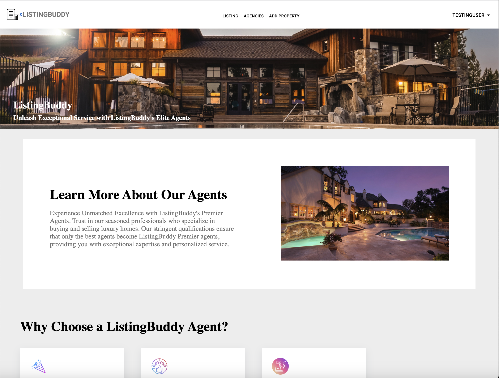
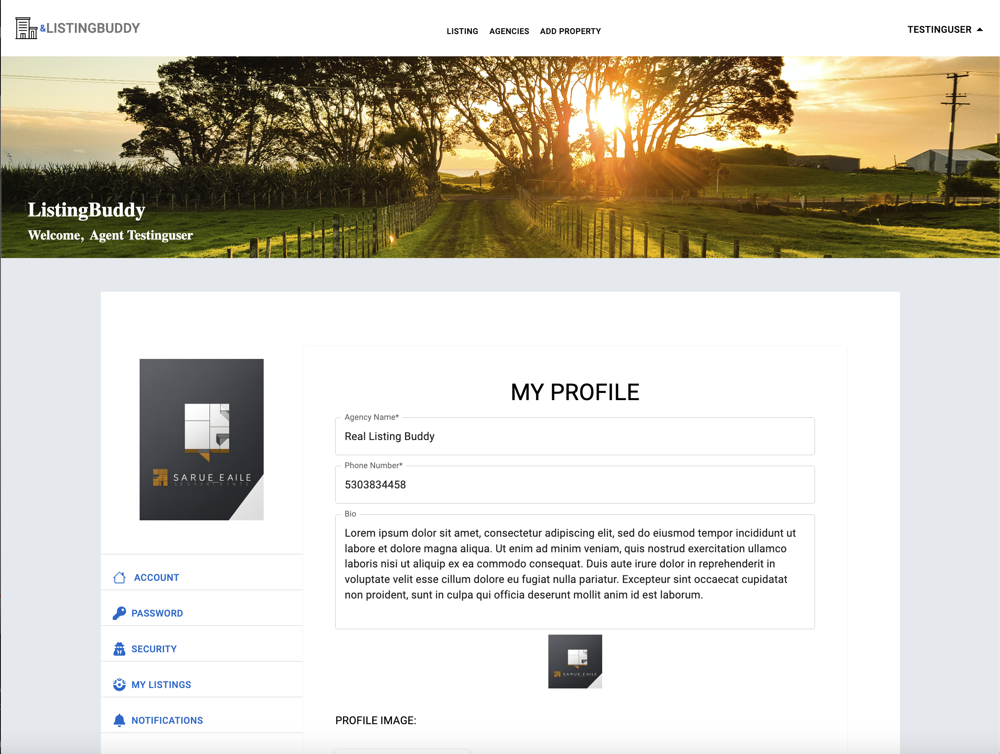
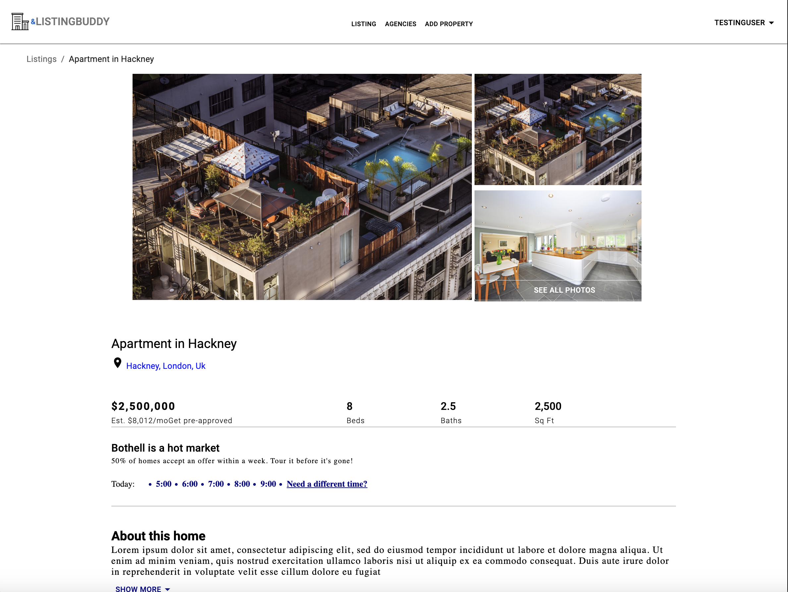
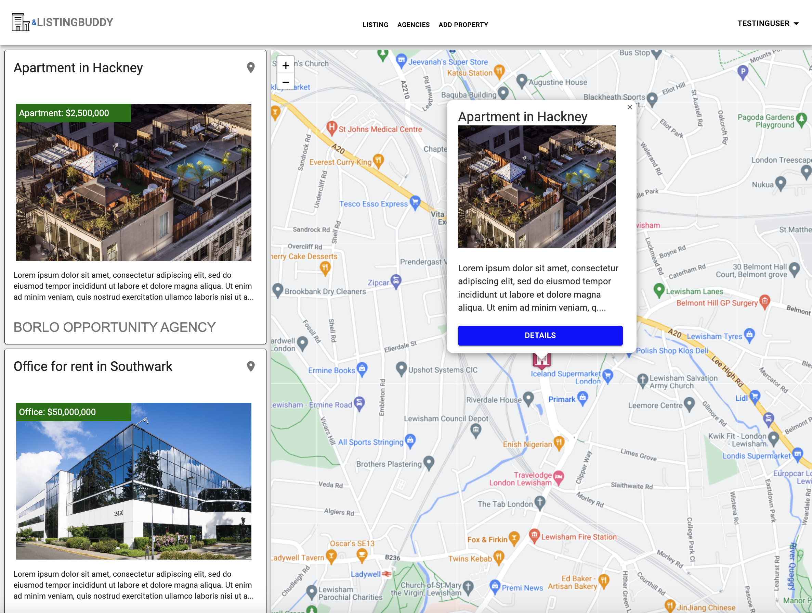

# Location-Based Real Estate Website

This is a location-based real estate website project developed as part of a course. It is a full stack web application with Django powering the backend and React Js handling the frontend.

## Table of Contents

- [Overview](#overview)
    - [Screenshot](#screenshot)
    - [Links](#links)
    - [Technologies Used](#technologies-used)
    - [Features](#features)
- [Database](#database)
- [Contact](#contact)

## Overview

The Location-Based Real Estate Website project is a full stack web application that combines Django and React Js to create a platform for showcasing real estate listings. The website utilizes Material UI, a React library for building UI components, to design and style the frontend. Leaflet, a JavaScript library for interactive maps, is integrated with React using React-Leaflet to add a geographic aspect to the project.

The PostgreSQL database used in this project is made spatially aware by adding the PostGIS extension. This allows for both regular and spatial queries, including geometric information such as distance calculations.

User authentication is implemented using the Djoser library, enabling users to add, delete, or update property listings from the frontend. Error handling for both client-side and server-side errors in forms is also covered.

### Screenshot

### Links

- [Live Demo](https://vaqueraoscar0.github.io/Real-Estate-Website/)

### Technologies Used

The project utilizes the following technologies:

- Django
- React 18.2
- Material UI 5
- React-Leaflet
- Django Rest Framework
- PostGIS
- Djoser
- Leaflet
- PostgreSQL
- Python
- Heroku
- Bootstrap
- Google Cloud Tools

### Features

The Location-Based Real Estate Website project includes the following features:

- Full stack web application with Django and React Js
- Material UI for easy and intuitive UI component creation
- Interactive maps using React-Leaflet and Leaflet library
- Building API endpoints with Django Rest Framework
- User authentication with Djoser
- Spatial queries and calculations with Geodjango and PostGIS
- Error handling for client-side and server-side form errors

## Database

The Location-Based Real Estate Website utilizes a PostgreSQL database hosted on a private virtual machine instance. This database was set up using Google Cloud Platform's tools.

## Contact

If you have any questions or need further assistance, please feel free to reach out. You can contact me at [vaqueraoscar0](mailto:vaqueraoscar0@gmail.com).

## Acknowledgements

- [ABDEL DIOUF](https://www.udemy.com/share/106hW23@1XrA8k1iV11RrXCbhq5auIXyhRRSPKvq603HPIg9wyQFh8a-K5E1GzH1uPpEdt9U/)